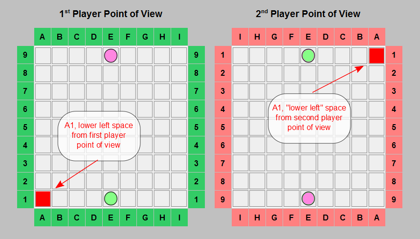
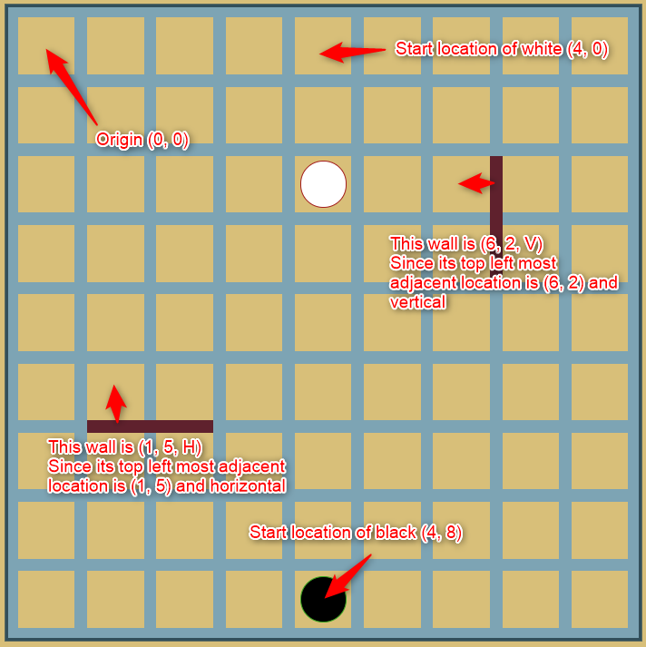

# Arena

> Author: Dipsy ([dipsywong98](https://github.com/dipsywong98))

## Story

Inspired by real life story...
Social distancing keeps you away from your friends,
so you can't play boardgames with your friends physically,
however at home your friends just play ring fit themselves but not boardgames.
Don't be sad there is still Arena can play boardgames with you.

## Challenge description

The Arena consists of two levels, level 1 [tic-tac-toe](https://en.wikipedia.org/wiki/Tic-tac-toe) and level
2 [quoridor](https://en.wikipedia.org/wiki/Quoridor). The tic-tac-toe is more of trying around the network protocol, and
the quoridor is where the real battle happens.

## Tic Tac Toe

### Goal

win the baseline AI, at least draw with the advanced AI and flip the table when necessary to win 20% of the score

### Rule

The good old tic-tac-toe rule, two players `O` and `X`, `O` go first, and then take turn to put their symbol to an empty
box in the 3x3 grid, the first to get three in a row/column/diagonal wins, otherwise when the grid is full it's a draw.

### Notation

Use this compass notation when requesting and handling response with arena tic-tac-toe.

```
|NW|N |NE|
+--+--+--+
|W |C |E |
+--+--+--+
|SW|S |SE|
```

### How to play

1. Request for grading tic-tac-toe at the coordinator
2. Coordinator will ask Arena to play tic-tac-toe with you. Arena will `POST` to your `/tic-tac-toe` with `battleId` in
   the body

```json
{
  "battleId": "21083c13-f0c2-4b54-8cb1-090129ffaa93"
}
```

3. Your system `GET` `{arenaEndpoint}/tic-tac-toe/start/{battleId}`, which is
   an [`event/stream`](https://developer.mozilla.org/en-US/docs/Web/API/Server-sent_events/Using_server-sent_events)
   that it can keep pushing latest update (aka events) of the battle to you. The possible events are in the next section

4. When it is your turn, you need to submit your move in 2 seconds. To submit move, `POST`
   to `{arenaEndpoint}/tic-tac-toe/play/{battleId}` with payload

```json
{
  "action": "putSymbol",
  "position": "SE"
}
```

where positions is the compass notation for the grid

5. Invalid moves are considered as surrendering, and the opponent should flip the table. To flip table, `POST`
   to `{arenaEndpoint}/tic-tac-toe/play/{battleId}` with payload

```json
{
   "action": "(╯°□°)╯︵ ┻━┻"
}
```

### Events

Initial event tells your symbol
```
data: {"youAre":"O","id":"15f6301f-cbdd-4084-a810-df2e9c83238f"}
```

Move event tells you who made what move
```
data: {"player":"O","action":"putSymbol","position":"NW"}
```

Game end event tells you the game end result
```
data: {"winner":"draw"}
data: {"winner":"O"}
```

Flip table tells you someone flipped table and who flipped it
```
data: {"player":"O","action":"(╯°□°)╯︵ ┻━┻"}
```

## Quoridor

### Goal

Win the baseline AI, survive long enough when battling with advanced AI and flip table when necessary to win the 70% of the scores,
10% for winning the advanced AI!

### Rule

(copy paste from wiki)

Quoridor is played on a game board of 81 square spaces (9x9). Each player is represented by a pawn which begins at the center space of one edge of the board (in a two-player game, the pawns begin opposite each other). The objective is to be the first player to move their pawn to any space on the opposite side of the game board from which it begins.

The distinguishing characteristic of Quoridor is its twenty walls. Walls are flat two-space-wide pieces which can be placed in the groove that runs between the spaces. Walls block the path of all pawns, which must go around them. The walls are divided equally among the players at the start of the game, and once placed, cannot be moved or removed. On a turn, a player may either move their pawn, or, if possible, place a wall.

Legal pawn moves according to the location of the opponent and the walls.
Pawns can be moved to any space at a right angle (but not diagonally). If adjacent to another pawn, the pawn may jump over that pawn. If an adjacent pawn has a third pawn or a wall on the other side of it, the player may move to either space that is immediately adjacent (left or right) to the first pawn. Multiple pawns may not be jumped. Walls may not be jumped, including when moving laterally due to a pawn or wall being behind a jumped pawn.

Walls can be placed directly between two spaces, in any groove not already occupied by a wall. However, a wall may not be placed which cuts off the only remaining path of any pawn to the side of the board it must reach.

### Notation

We use the [standard quoridor notation](https://quoridorstrats.wordpress.com/notation/) for the arena quoridor game.

You maybe `first` or `second` player, 
first player will start at `e1`, and second start at `e9`.
First will win if it reaches row `9` and second win if it reaches row `1`.

For walls, each player will have 10




### How to play

1. Request for grading quoridor at the coordinator
2. Coordinator will ask Arena to play quoridor with you. Arena will `POST` to your `/quoridor` with `battleId` in
   the body

```json
{
  "battleId": "21083c13-f0c2-4b54-8cb1-090129ffaa93"
}
```

3. Your system `GET` `{arenaEndpoint}/quoridor/start/{battleId}`, which is
   an [`event/stream`](https://developer.mozilla.org/en-US/docs/Web/API/Server-sent_events/Using_server-sent_events)
   that it can keep pushing latest update (aka events) of the battle to you. The possible events are in the next section

4. When it is your turn, you need to submit your move in 5 seconds. To submit move, `POST`
   to `{arenaEndpoint}/quoridor/play/{battleId}`.

Move your pawn:
```json
{
  "action": "move",
  "position": "e8"
}
```

Where `position` is the chess notation location that you want to move your pawn to.

Place wall:
```json
{
   "action": "putWall",
   "position": "a8h"
}
```

Where `position` is a 3 character standard quoridor notation indicating the wall's placement

5. Invalid moves are considered as surrendering, and the opponent should flip the table. To flip table, `POST`
   to `{arenaEndpoint}/quoridor/play/{battleId}` with payload

```json
{
   "action": "(╯°□°)╯︵ ┻━┻"
}
```

### Events

Initial event tells your color
```
data: {"youAre":"second","id":"15f6301f-cbdd-4084-a810-df2e9c83238f"}
```

```
data: {"youAre":"first","id":"15f6301f-cbdd-4084-a810-df2e9c83238f"}
```

Move event tells you who made what move
```
data: {"player":"second","position":"e8","action": "move"}
```
```
data: {"player":"first","position":"e6v","action": "putWall"}
```

Game end event tells you the game end result
```
data: {"winner":"first"}
data: {"winner":"second"}
```

Flip table tells you someone flipped table and who flipped it
```
data: {"player":"first","action":"(╯°□°)╯︵ ┻━┻"}
```
